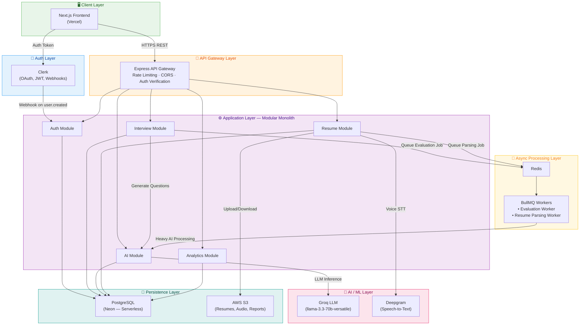
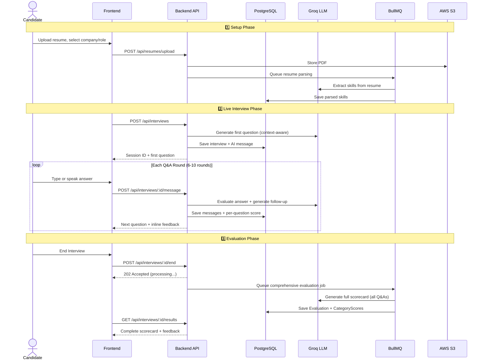
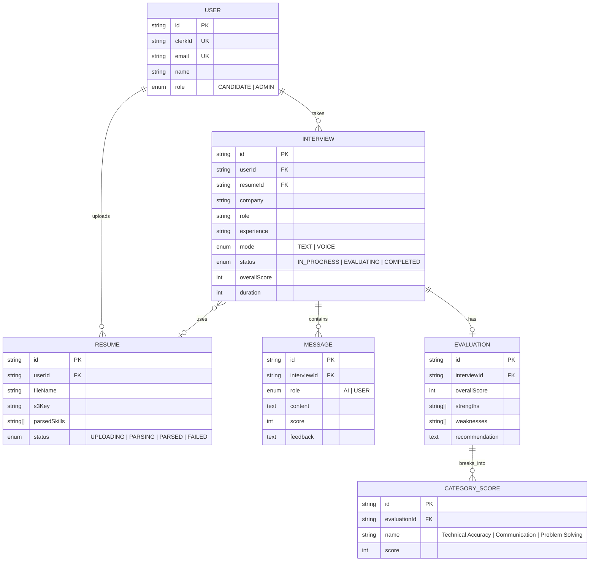

# 🤖 AI Interviewer Platform

An enterprise-grade, AI-powered mock interview platform that conducts realistic, company-specific interviews with real-time voice/text evaluation, detailed scorecards, and actionable feedback.

Built as a **modular monolith** designed to scale into microservices — showcasing system design, AI integration, background queues, cloud storage, and modern web architecture.

---

## 🎥 Demo

| Landing Page | Dashboard | Interview Room | Scorecard |
|---|---|---|---|
| Hero + Features | Stats + Bar Chart | AI + User Avatars | Score Circle + Feedback |

---

## 🏗️ System Architecture (HLD)



### Why This Architecture?

| Layer | Technology | Why We Chose It |
|---|---|---|
| **Frontend** | Next.js + Shadcn UI | Server-side rendering for SEO, App Router for nested layouts, Shadcn for enterprise-grade accessible UI |
| **Auth** | Clerk | Production-ready auth in minutes — OAuth, JWT, webhook sync — so we don't waste time building auth from scratch |
| **API Gateway** | Express + Rate Limiter | Single entry point with CORS, Helmet security headers, and per-IP rate limiting (100 req/15min) |
| **AI Engine** | Groq (llama-3.3-70b) | Ultra-low latency inference (~200ms). Structured JSON output for scores/feedback. Cost-effective at scale |
| **Voice** | Deepgram | Real-time streaming STT with <300ms latency. Enterprise-grade accuracy |
| **Queue** | BullMQ + Redis | Prevents API timeout on heavy AI calls. Workers process evaluation jobs async with retry + exponential backoff |
| **Database** | PostgreSQL (Neon) | Relational data (users → interviews → messages → scores). Neon gives serverless Postgres with branching |
| **Storage** | AWS S3 | Infinite scale for resume PDFs and audio recordings. Pre-signed URLs for secure direct client uploads |

---

## 🔄 Interview Flow — End to End



---

## 🗄️ Database Schema



---

## 🛠️ Tech Stack

### Frontend
| Technology | Purpose |
|---|---|
| **Next.js 15** (App Router) | React framework with SSR, nested layouts, file-based routing |
| **TypeScript** | Type safety across the entire codebase |
| **Tailwind CSS** | Utility-first styling with custom green enterprise theme |
| **Shadcn UI** | Accessible, unstyled component primitives (Card, Button, Select, etc.) |
| **Framer Motion** | Smooth micro-animations (fade-up, hover effects) |
| **Recharts** | Data visualization (bar charts, score progression) |
| **Zustand** | Lightweight global state management (interview session, voice state) |
| **Clerk** | Drop-in authentication (OAuth, JWT) |

### Backend
| Technology | Purpose |
|---|---|
| **Node.js + Express** | REST API server |
| **TypeScript** | End-to-end type safety |
| **Prisma ORM** | Type-safe database queries, migrations, schema management |
| **PostgreSQL** (Neon) | Relational database for users, interviews, scores |
| **Groq SDK** | LLM inference (question generation, answer evaluation, feedback) |
| **BullMQ + Redis** | Background job processing (evaluation, resume parsing) |
| **AWS S3** | File storage (resumes, audio recordings, PDF reports) |
| **Zod** | Runtime request validation with structured error messages |
| **Helmet + CORS** | Security headers and cross-origin protection |
| **Morgan** | HTTP request logging |
| **Multer** | Multipart file upload handling |

---

## 📡 API Endpoints

### Auth
| Method | Endpoint | Description |
|---|---|---|
| `POST` | `/api/auth/webhook` | Clerk webhook — syncs user data to PostgreSQL on `user.created`, `user.updated`, `user.deleted` |
| `GET` | `/api/auth/me` | Get current authenticated user profile |

### Interviews
| Method | Endpoint | Description |
|---|---|---|
| `POST` | `/api/interviews` | Create a new interview session (company, role, experience, mode) |
| `GET` | `/api/interviews` | List all interviews for the authenticated user (paginated) |
| `GET` | `/api/interviews/:id` | Get a single interview with its message history |
| `POST` | `/api/interviews/:id/message` | Submit an answer → receive AI's next question + inline score |
| `POST` | `/api/interviews/:id/end` | End interview → queues background evaluation job → returns 202 |
| `GET` | `/api/interviews/:id/results` | Get the completed scorecard (or 202 if still processing) |

### Resumes
| Method | Endpoint | Description |
|---|---|---|
| `POST` | `/api/resumes/upload` | Upload a resume PDF → stores in S3 → queues parsing job |
| `GET` | `/api/resumes/:id/download` | Get a pre-signed S3 download URL (expires in 1 hour) |

### AI
| Method | Endpoint | Description |
|---|---|---|
| `POST` | `/api/ai/generate-question` | Generate the next contextual interview question via Groq |
| `POST` | `/api/ai/evaluate-answer` | Evaluate a single answer (score, feedback, follow-up) |
| `POST` | `/api/ai/generate-feedback` | Generate comprehensive feedback report (called by BullMQ worker) |

### Analytics
| Method | Endpoint | Description |
|---|---|---|
| `GET` | `/api/analytics/dashboard` | User's dashboard stats (total interviews, avg score, top skill, weekly chart) |
| `GET` | `/api/analytics/admin` | Platform-wide admin stats (total users, interviews, active today) |

---

## 📁 Project Structure

```
AI_Interviewer_platform/
│
├── frontend/                          # Next.js Frontend
│   ├── src/
│   │   ├── app/
│   │   │   ├── page.tsx               # Landing Page
│   │   │   ├── dashboard/
│   │   │   │   ├── layout.tsx         # Sidebar + Nav
│   │   │   │   └── page.tsx           # Dashboard (stats, chart)
│   │   │   └── interviews/
│   │   │       ├── new/page.tsx       # Interview Setup
│   │   │       ├── live/[id]/page.tsx # Live Interview Room
│   │   │       └── [id]/results/page.tsx # Scorecard
│   │   ├── components/ui/             # Shadcn components
│   │   └── store/
│   │       └── interview-store.ts     # Zustand state
│   └── package.json
│
├── backend/                           # Express Backend
│   ├── prisma/
│   │   └── schema.prisma             # 6 relational models
│   ├── src/
│   │   ├── config/index.ts           # Environment config
│   │   ├── controllers/              # Route handlers
│   │   │   ├── ai.controller.ts
│   │   │   ├── analytics.controller.ts
│   │   │   ├── auth.controller.ts
│   │   │   ├── interview.controller.ts
│   │   │   └── resume.controller.ts
│   │   ├── middlewares/              # Express middlewares
│   │   │   ├── async-handler.ts      # Async error wrapper
│   │   │   ├── error-handler.ts      # Centralized error handling
│   │   │   ├── not-found.ts          # 404 handler
│   │   │   └── validate.ts           # Zod validation factory
│   │   ├── routes/                   # API route definitions
│   │   ├── services/                 # Business logic (isolated)
│   │   │   ├── ai.service.ts         # Groq LLM calls
│   │   │   ├── queue.service.ts      # BullMQ queues + workers
│   │   │   └── storage.service.ts    # AWS S3 operations
│   │   ├── validators/               # Zod request schemas
│   │   ├── lib/prisma.ts             # Singleton DB client
│   │   ├── app.ts                    # Express app
│   │   └── server.ts                 # Entry point
│   └── package.json
│
└── frontend_context.md               # UI/API mapping doc
```

---

## 🚀 Scaling Strategy

```mermaid
graph LR
    subgraph Phase1["Phase 1: MVP"]
        direction TB
        P1A["Single Express Server"]
        P1B["Neon PostgreSQL"]
        P1C["Redis Cloud"]
        P1D["Vercel (Frontend)"]
    end

    subgraph Phase2["Phase 2: Growth — 1K-10K Users"]
        direction TB
        P2A["Load Balancer (ALB)"]
        P2B["2-4 Express Instances"]
        P2C["PostgreSQL + Read Replicas"]
        P2D["Redis Cluster"]
        P2E["CDN (CloudFront)"]
    end

    subgraph Phase3["Phase 3: Scale — 10K+ Users"]
        direction TB
        P3A["AWS API Gateway"]
        P3B["Auth Microservice"]
        P3C["Interview Microservice"]
        P3D["AI Microservice (Lambda/ECS)"]
        P3E["Analytics Microservice"]
        P3F["Kubernetes / ECS"]
    end

    Phase1 -->|"Traffic ↑"| Phase2
    Phase2 -->|"Need isolation"| Phase3

    style Phase1 fill:#e8f5e9,stroke:#4caf50
    style Phase2 fill:#fff3e0,stroke:#ff9800
    style Phase3 fill:#e3f2fd,stroke:#2196f3
```



| Problem | Solution | Rationale |
|---|---|---|
| AI calls block the Express event loop | BullMQ workers in separate processes | API responds in <200ms, heavy AI work runs async |
| Database bottleneck on dashboard reads | PostgreSQL Read Replicas | 80% of queries are reads — offload to replicas |
| Sessions pinned to one server | Stateless JWT + Redis cache | Any server can handle any request — horizontal scaling |
| File uploads consume API bandwidth | Pre-signed S3 URLs | Client uploads directly to S3 — zero server bandwidth |
| Single point of failure | Health checks + auto-restart + retries | BullMQ retries failed jobs with exponential backoff |

---

## ⚡ Quick Start

### Prerequisites
- Node.js 18+
- PostgreSQL (or [Neon](https://neon.tech) free tier)
- Redis (or [Upstash](https://upstash.com) free tier)
- [Groq API Key](https://console.groq.com)
- [Clerk Account](https://clerk.com)

### Backend
```bash
cd backend
cp .env.example .env          # Fill in your API keys
npm install
npm run db:push               # Push schema to PostgreSQL
npm run dev                   # Starts on http://localhost:8000
```

### Frontend
```bash
cd frontend
npm install
npm run dev                   # Starts on http://localhost:3000
```

---

## 📄 License

MIT © Ishaan Aggrawal
